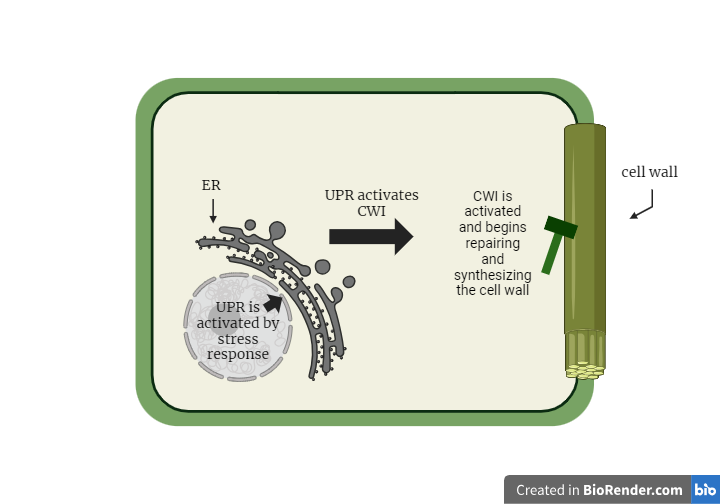
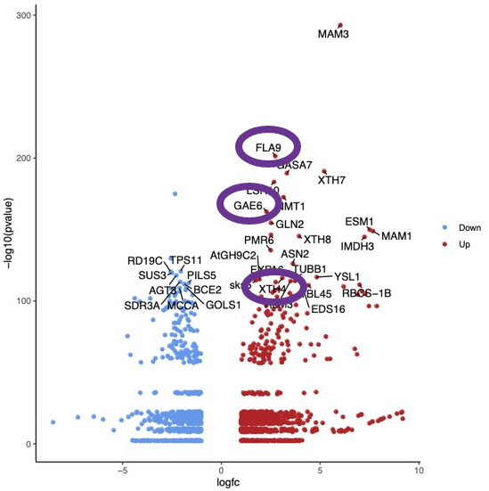
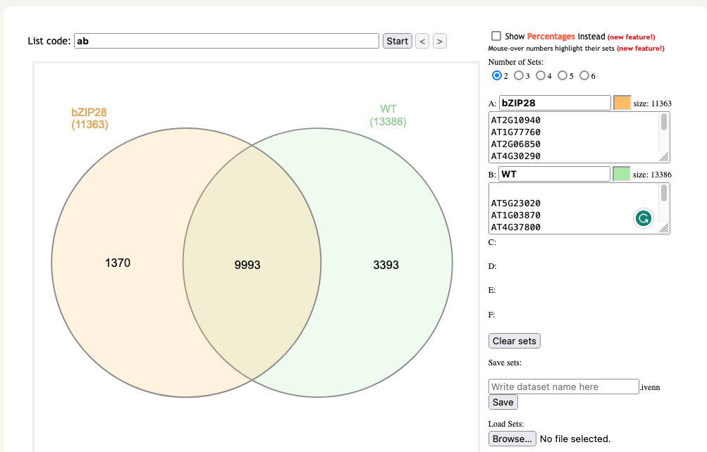
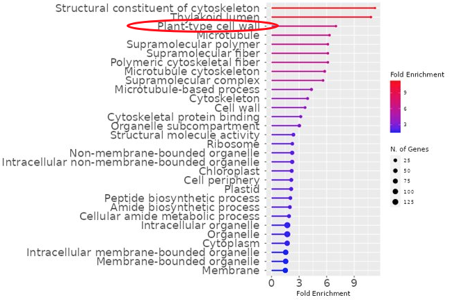
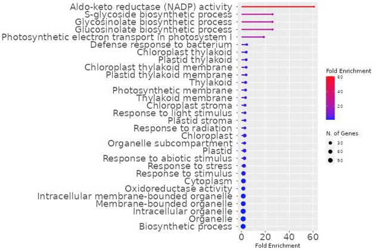

# Copy of GSR\_Investigating CWI and UPR

**Investigating the Relationship between the Cell Wall Integrity Pathway and Unfolded Protein Response in **_**Arabidopsis thaliana**_

Ryan Buschman\*,1,5, Brooke Hill\*,2,5, Margaret Hitt\*,3,5, Fatima Khawaja\*,4,5, Jennifer Claudio5,6, and Dr. Elizabeth Blaber5,6,7

\*These authors contributed equally to the research work

1 Haddonfield Memorial High School, NJ

2 Granite Bay High School, CA​

3 H.H. Dow High School, MI; Student Research Group Lead

4 James Logan High School, CA​

5 NASA Ames Research Center, GeneLab for High Schools, CA

6 NASA Ames Research Center, GeneLab for High Schools, CA; Research Mentor

7 Department of Biomedical Engineering, Rensselaer Polytechnic Institute, NY

**Abstract**

Spaceflight-grown crops are critical to sustaining human presence in space as they are necessary for space diets and astronaut health. This research aims to provide a holistic understanding of the molecular mechanisms underlying plant adaption to spaceflight stressors. Recent multi-omics studies conducted on _Arabidopsis_ _thaliana_, a model plant, have revealed that gene expressions related to cell wall integrity (CWI) and unfolded protein response (UPR) are altered in spaceflight-grown crops. Considering these findings, this research has reanalyzed the _Arabidopsis_ gene-expression dataset GLDS-321 from the NASA Open Science Data Repository and identified _bZIP28_ and _IRX7_ genes as crucial regulators that influence intracellular communication between CWI and UPR. This research proposes a multi-omics experiment with RNA-sequencing analyses and a machine learning vision tool, such as _DeepLabCut_, to quantify the morphological changes in _IRX7_ mutants compared to wild-type plants. These data would verify the hypothesis that silencing _IRX7_ leads to downregulating UPR and consequent cell wall damage, resulting in weaker crops. Conversely, overexpressing _IRX7_ leads to the upregulation of UPR, resulting in thicker cell walls and more robust crops. This research may provide insight into measures necessary to optimize cell wall resilience in space and extreme conditions on Earth.&#x20;

_Keywords: Unfolded Protein Response, Cell Wall Integrity Pathway, IRX7, Secondary Cell Wall Biogenesis, Space Biology, Bioinformatics, Data Analysis, Astrobotany, Astrobiology, Resilient Plants, Genetics, GLDS-321_

**Investigating the Relationship between the Cell Wall Integrity Pathway and Unfolded Protein Response in **_**Arabidopsis thaliana**_

Recent studies have shown that spaceflight stressors impact the regulation of cell wall synthesis and growth (Johnson et al., 2017; Kruse et al., 2020; Barker et al., 2023). It is well-understood that the cell wall is essential to maintaining structural integrity, providing flexibility to support cell division, and acting as a barrier against environmental and pathological stresses (Houston et al., 2016). The cell wall has several pathways that foster plant viability, including secondary cell wall biogenesis, which maintains cell wall rigidity, protects against the force of transpiration in plants (Zhong et al., 2019), and regulates the CWI pathway, i.e., a pathway responsible for correcting adverse environmental stimuli that affect cell walls (Zhang et al., 2021). However, how the CWI pathway responds to spaceflight stressors is still understudied.

Recent multi-omics studies conducted on _Arabidopsis thaliana_, a model plant commonly used in space experiments, have revealed that gene expression related to the unfolded protein response (UPR) is altered in spaceflight-grown crops. The UPR is a signaling cascade activated in response to various environmental stresses in the endoplasmic reticulum (ER); the UPR is activated upon the accumulation of unfolded proteins in the cell lumen. For example, Angelos et al.'s (2021) study on how modifications to the UPR may affect gene expression of _Arabidopsis thaliana_ in spaceflight. Their study aims to understand the UPR's relevance in space conditions during the SpaceX-CRS12 mission to the International Space Station (ISS) by comparing the UPR transcriptional responses of wild type (WT), i.e., seedlings with no gene alterations, with the deficient UPR transcriptional responses of seedlings with gene alterations, such as mutated seedlings with deleted _bZIP28_ gene. The study results indicate that when comparing differential gene expression on ground control versus spaceflight experiments, seedlings with deficient UPR transcriptional responses had more differentially expressed genes than WT seedlings, leading to an implication that the unique space conditions induce changes in the expression of stress-related genes and activate signaling pathways.

Considering these findings, this research reanalyzed the dataset GLDS-321 available on the NASA Open Science Data Repository (Brandizzi & Angelos, 2021) and found that the _bZIP28_ mutant seedlings had the most differentially expressed cell-wall genes in comparison to WT among such seedlings with deficient UPR transcriptional responses as _bZIP28_, bZIP60, _bZIP28_ bZIP60, and _atire1_. This finding prompted further investigation of the interconnectedness of the UPR and the CWI pathway.

According to Krysan et al. (2009) and Scrimale et al. (2009), there is evidence of a connection between the UPR and the CWI pathway in _Saccharomyces cerevisiae_ (yeast): the communication between the UPR and CWI enables cell wall biosynthesis, providing a buffer against defective proteins. Given that yeast and _Arabidopsis thaliana_ have similar cell wall architectures (Voxeur & Hofte, 2016), it is reasonable to draw parallels in the connection between UPR and CWI pathway between yeast and _Arabidopsis thaliana._ As such, this research postulates a relationship between the UPR and the CWI pathway in _Arabidopsis thaliana_ (see Figure 1 on page 5). As there has not been published literature on the connection between UPR and CWI pathway in plants, investigating such a connection may provide insight into cell wall synthesis and growth when the organisms are under stress.

The intercellular communication between the UPR and the CWI pathway in plants has been shown to facilitate cell wall biogenesis. Notably, the _bZIP28_ mutant seedlings exhibited differential expression of _IRX7_ (Irregular Xylem Gene7), a gene involved in secondary cell wall biogenesis, as revealed in the Data Analysis section of this research spanning pages 7-10. Therefore, it is imperative to conduct a thorough investigation into the role of the _IRX7_ gene in modulating the CWI pathway and, potentially, the UPR to gain deeper insights into the mechanisms underlying the regulation of cell wall synthesis and growth in spaceflight-induced stressors.

Based on the postulation between the intercellular communication between the UPR and CWI pathways and the importance of studying _IRX7_, this research proposes an experimental design with a control group, WT _Arabidopsis thaliana,_ and two experimental groups, silenced and overexpressed _IRX7_ _Arabidopsis thaliana_ mutant. This design is further supported by Brown et al. (2005) study on the _IRX7_ gene being responsible for secondary cell-wall biogenesis and decreasing cellulose content when mutated. The decreased cellulose content resulted in negatively impacted plant morphology in _Arabidopsis thaliana_ compared to WT. As such, the experimental design will also include a method to measure the morphological changes in tandem with the intercellular communication between the UPR and CWI pathway.

**Figure 1**

_A visualization of how the UPR may activate the CWI pathway in plants._

_Note._ A stress response in the endoplasmic reticulum (ER) activates UPR. The activation of the UPR creates a cascade that evokes the CWI pathway to repair and synthesize the cell wall.

**Preliminary Data**

_**Dataset GLDS-321**_

The dataset GLDS-321 was part of the 2017 SpaceX-CRS12 mission to the ISS. The _Arabidopsis thaliana_ samples were tested for the effects of the loss of the UPR regulators. The ground control experiments were conducted at the Kennedy Space Center (KSC), whereas spaceflight experiments on the ISS. Each experiment included five genotypes of _Arabidopsis thaliana_: WT, _atire1, bZIP60, bZIP28, and bZIP28/bZIP60._ Additionally, the five genotypes were placed in either four (_atire1, bZIP28, bZIP60_) or five (_bZIP28_/bZIP60 and WT) Petri dishes, with 70-80 equidistant seedlings and the necessary media supplements.&#x20;

_Arabidopsis thaliana_ seedling samples were in space for 14 days. Both ISS returned samples and KSC samples were transported to Michigan State University for RNA sequencing. An RNA-sequencing library was then constructed, and _FastQC_ analysis was conducted to check the quality of the RNA-sequencing raw data to rule out sequencing data errors such as low-quality reads, low-confidence bases, sequence-specific bias, 3’/5’ positional bias, and untrimmed adaptors (Blaber & Samrawit, 2021). The quality-filtered data were then aligned with the _TAIR-10_ (_Arabidopsis thaliana_) reference genome to guide the assembly of the transcriptome, and the _DESeq2_ was used to interpret the assembled transcriptome to estimate the significance of gene expression between the ground control and spaceflight. The resulting metadata presented in this research is the transcriptomic analysis of the sequenced RNA data.

Although GLDS-321 already used _FastQC_ on the raw RNA-sequencing data, this research conducted a separate _FastQC_ analysis through the open-source _Galaxy_ platform. After analyzing all five genotypes, the _bZIP28_ gene was chosen for further analysis for two reasons. First, there are 8 out of the 27 significant genes related to the cell wall, whereas only 3 out of the 31 genes in WT related to the cell wall (see Figures 2a and 2b). Second, there is little research concerning the relationship between the UPR and the CWI pathway.

| 
<strong>Figure 2a</strong>

<em>The impact of spaceflight on bZIP28 mutant gene expression in Arabidopsis thaliana.</em>
                                                                                                                                                                                                                                                                                                                        | 
<strong>Figure 2b</strong>

<em>The impact of spaceflight on WT gene expression in Arabidopsis thaliana.</em>
                             |
| ----------------------------------------------------------------------------------------------------------------------------------------------------------------------------------------------------------------------------------------------------------------------------------------------------------------------------------------------------------------------------------------------------------------------------------------------------------- | ----------------------------------------------------------------------------------------------------------------------------------------------------- |
|                                                                                                                                                                                                                                                                                                                                                                                                         |  |
| _Note. Volcano Plot_ showing the relative expression of genes in spaceflight compared to ground control. Figure 2a shows in the _bZIP28_ mutant seedlings. 8 of the 27 significant genes were related to cell wall structure (highlighted with purple circles; _IRX7_ highlighted with an additional red circle). In WT control, 3 of the 31 significant genes in the _Volcano Plot_ were related to cell wall structure (highlighted with purple circles). |                                                                                                                                                       |

_**Data analysis**_

This research reanalyzed the GLDS-321’s raw RNA-sequencing data using _FastQC_ available on the open-source _Galaxy_ platform to ensure the data was of high quality and low bias. It also used _Trim Galore!_ to cut untrimmed adaptors, _RNA STAR_ to align sequences, and _featurecounts_ to quantify RNA sequencing reads. The _DESeq2_ tool from _Galaxy_ was used to determine the most significant and differentially expressed genes in the _bZIP28_ mutant seedlings and WT (_p-value_ < 0.05; _LogFC_ < 1.0), and a _Volcano Plot_ was created (see Figures 2a & 2b on page 7). In Figures 2a and 2b, the adjusted _p-value_ accounted for false discovery rates. The _LogFC_ indicates the magnitude of the up-or-down-regulation of genes from the ground control versus spaceflight, ensuring control over differential gene expressions.

The values depicted in the _Volcano Plot_ indicate the significance of the genes in the WT and _bZIP28_ mutant seedlings. Genes from WT and the _bZIP28_ mutant seedlings were sorted by _InteractiVenn Diagrams_ to find genes unique to WT and the _bZIP28_ mutant seedlings (see Figure 3). There are 1370 genes from the _bZIP28_ mutant seedlings that are _not_ expressed in WT. Of the 11,363 genes from the _bZIP28_ mutant seedlings, 13,386 genes from WT were analyzed. Among the 1370 genes from the _bZIP28_ mutant seedlings, the _IRX7_ gene stands out because it is the only downregulated cell wall gene, as shown in Figure 2a. It is worth noticing that compared to the _bZIP28_ mutant seedlings, there are no downregulated cell wall genes in WT, as shown in Figure 2b.&#x20;

**Figure 3**

_Shared gene expression changes in bZIP28 and WT Arabidopsis thaliana._

_Note._ Using _InteractiVenn_, shared genes were compared between _bZIP28_ and WT _Arabidopsis thaliana_.

These 1,370 genes in _bZIP28_ mutant seedlings and 3,393 genes in WT were plugged into _ShinyGo_ to identify significant pathways_._ The results showed a recurring pattern such that the gene expression of the _bZIP28_ mutant seedlings was altered in cell wall pathway (see Figure 4a), whereas there are no pathways related to the cell wall in WT (see Figure 4b). This implies that even though the _Lollipop Plots_ detect small changes in gene expression, WT shows no change in expressions of cell wall genes.

| 
<strong>Figure 4a</strong>

<em>The impact of spaceflight on pathways in bZIP28</em> mutant seedlings
                                                                                                                                                                                                                                                                                                                         | 
<strong>Figure 4b</strong>

<em>The impact of spaceflight on pathways in WT</em>
 |
| ----------------------------------------------------------------------------------------------------------------------------------------------------------------------------------------------------------------------------------------------------------------------------------------------------------------------------------------------------------------------------------------------------------------------------------------- | -------------------------------------------------------------------------------------------- |
|                                                                                                                                                                                                                                                                                                                                                                              |                                 |
| _Note. Lollipop Plots_ highlight the most enriched pathways. One of the most recurring pathways labeled as significant in _bZIP28_ was cell-wall-related pathways (highlighted with a red circle). This implies that the deletion of _bZIP28_ impacts the cell wall pathway. In WT, there are no pathways related to the cell wall in fold enrichment, which highlights the impact of the deletion of _bZIP28_ on the cell wall pathways. |                                                                                              |

Because the _IRX7_ gene is down-regulated by a log fold change (_LogFC_) of -1.608 and has a statistically significant _p-value_ (as shown in Figure 2a), it is reasonable to claim the cell wall genes are only affected when a gene responsible for UPR transcriptional response, i.e., _bZIP28_ is silenced. That is, the deletion of the _bZIP28_ gene could catalyze changes in the cell wall pathway. As the _IRX7_ gene is a key regulator in the CWI pathway for correcting adverse environmental stimuli that affects cell wall (Zhang, et al., 2021) and _bZIP28_ gene is the key regulator in the UPR, it is reasonable to claim that the _IRX7_ gene may also play a role for the intracellular communication between the UPR and CWI pathway.

In a word, based on these data analysis results, it is reasonable to assert that the study of intracellular communication between the UPR and CWI is crucial to gain a holistic understanding of how the cell wall responds to the environmental stress and that the investigation of the IRX7 gene is necessary for the study of the intracellular communication between the UPR and CWI.

**Hypothesis and Aims**

This research hypothesizes that the _IRX7_ gene, which oversees secondary cell wall biogenesis, affects the communication between the UPR and the CWI pathway, leading to cell wall integrity and rigidity changes. This hypothesis is generated based on the results from the _Preliminary Data_ section: the _bZIP28_ gene (a key transcription factor in the UPR) and _IRX7_ gene (Irregular Xylem Gene7) are identified as crucial regulators that influence intracellular communication between CWI and UPR. As the _IRX7_ gene regulates cellulose, lignin, and xylem production and essential components in the cell wall structure (Brown et al., 2005) and prevents cell wall defects (Ramírez et al_.,_ 2019), the modification to the _IRX7_ gene will be expected to impact the cell wall architecture and unfolded protein accumulation when _Arabidopsis thaliana_ seedlings are under environmental stress.

Two assess the hypothesis, two aims are configured. They are:

1\) To investigate the effect of ​over-expressing and silencing ​_IRX7_ on the CWI pathway and the UPR, which would provide evidence that genes involved in the UPR regulation are affected.

2\) To determine how cell wall integrity affects the morphology of _Arabidopsis thaliana​_, presuming that cell wall defects and change in overall plant morphology will change.

**Experimental Design and Expected Results**

The research experiment investigates the effects of silencing and overexpressing _IRX7_ on plant cell wall resilience. To achieve this, the study proposes a multi-omics experiment that combines RNA-sequencing analyses with a Machine-Learning tool, such as DeepLabCut vision technique to quantify plant growth and morphological changes. The experiment aims to quantify the morphological changes in _IRX7_ mutant plants compared to wild-type plants and verify the hypothesis that silencing _IRX7_ leads to downregulating UPR, resulting in weaker crops due to cell wall damage. Conversely, overexpressing _IRX7_ leads to the upregulation of UPR, resulting in thicker cell walls and more robust crops.

The methods and materials are built on the baseline procedures of dataset GLDS-321 to enable comparison between the biological data of this experiment and dataset GLDS-321. There will be a control group and two experimental groups (see Figure 5 on page 12). In the control group, _Arabidopsis thaliana_ WT will be used. In the respective experimental groups, the study will silence and overexpress _IRX7_. All groups will be tested in Biological Research in Canisters (BRICs) hardware on the ISS or the ISS environment simulator at KSC. Like the methods in dataset GLDS-321, each group will have five Petri dishes, each with 70 seedlings (for a total of 350 per experimental condition). See Table 1 for the overview of the proposed experiment.

**Figure 5**

_Visualization of Proposed Experimental Design_

_Notes._ Materials and Sites will be the same as dataset GLDS-321: Experiments will be done via Ground Control at KSC and the Experimental Site on the ISS for 14 days. There are two experimental groups: Exp.1 with silenced _IRX7_ and Exp. 2 with over-expressed _IRX7_.

**Table 1**

_Dependent and predicted independent variables for RNA sequencing, cellulose concentration, atomic microscopy, and DeepLabCut experiments._

| **Group (Method)** | **Independent Variable (**_**Arabidopsis thaliana**_**)** | **Predicted Dependent Variable (RNA Seq)** | **Predicted Dependent Variable (Cellulose Concentration)** | **Predicted Dependent Variable (Atomic Microscopy)** | **Predicted Dependent Variable (**_**DeepLabCut**_**)** |
| ------------------ | --------------------------------------------------------- | ------------------------------------------ | ---------------------------------------------------------- | ---------------------------------------------------- | ------------------------------------------------------- |
| _Control Group_    | WT                                                        | Baseline expression of CWI and UPR genes   | Baseline in cellulose concentration                        | Baseline in the cell wall, and ER                    | Baseline plant morphology                               |
| _Exp. Group 1_     | Silenced _IRX7_                                           | Decreased expression of CWI and UPR genes  | Decreased cellulose concentration                          | Decrease in the cell wall, and ER                    | Negative change in plant morphology metrics             |
| _Exp. Group 2_     | Over-expressed _IRX7_                                     | Increased expression of CWI and UPR genes  | Increased cellulose concentration                          | Increase in the cell wall, and ER                    | Change in plant morphology                              |

_**Experimental Group 1**_

IRX7 will be silenced using siRNA (small, interfering RNA). The siRNA will be developed to interfere with the translation of IRX7, inserted into a plasmid, and then transferred into _Agrobacterium tumefaciens_ bacteria (Xu and Qingshun, 2008). These bacteria will be placed on the _Arabidopsis thaliana_ flowers to insert the plasmid, express the siRNA, and silence IRX7 in the resulting seedlings (Hwang _et al._, 2017). (See Figure 6). It is hypothesized that silencing IRX7 will impair cell wall integrity and, thus, downregulate the UPR.&#x20;

**Figure 6**

_DeepLabCut offers real-time quantification of plant morphology by capturing plant growth stages through a BRICs camera._ 

_Note._ A) _IRX7_ gene is knocked out the DNA of _Arabidopsis thaliana._ B) The subsequent DNA is then inserted into an _Agrobacterium-tumefaciens_ bacterium plasmid. The bacterium is placed onto the _Arabidopsis thaliana_ flower. The germinated seed will have a knocked-out _IRX7_ gene. C) _DeepLabCut_ will be used to trace and record the morphological changes. This enables the verification of crucial data: 1) Silencing _IRX7_ results in the downregulation of the UPR, causing cell wall damage and weakened seedlings. 2) Overexpressing _IRX7_ leads to the upregulation of the UPR, strengthening both cell walls and seedlings.

_**Limitations of Experimental Group 1**_

Incomplete silencing of _IRX7_ might occur, as achieving consistent and complete gene suppression can be difficult. Potential off-target effects, where gene silencing could inadvertently affect other genes due to sequence similarities, could further lead to unintended consequences. To address these problems, multiple siRNAs will be created. Polymerase chain reaction will be used to screen for siRNAs that successfully silence _IRX7_, and then RNAseq will be used to test for effects in other unrelated pathways. This will identify an optimal siRNA that is effective at silencing _IRX7_ and has minimal off-target effects.

_**Experimental Group 2**_

_IRX7_ will be overexpressed using the same _Agrobacterium tumefaciens_-mediated transformation strategy described in the _Experimental Group 1_, with a plasmid containing _IRX7_ (Hwang _et al._, 2017). The predicted result is that increased _IRX7_ expression will enhance cell wall resilience against environmental stresses by upregulating the UPR and CWI pathway.

_**Limitations of Experimental Group 2**_

Because the effects of _IRX7_ overexpression have not yet been studied on the cell wall, its impact on plant morphology remains uncertain. While the study of dataset GLDS-321 doesn’t show an upregulation of _IRX7_, there is a possibility of altered cell wall rigidity.

_**Methods for Experimental Group 1 and 2**_

Cellulose content measurement is an objective indicator of _IRX7_ overexpression or silencing effects. To test how _IRX7_ mutations affect the cell wall, the cellulose content of the plant will be measured. Cellulose, forming the plant cell wall's backbone, will be quantified using the Updegraff assay method. The Updegraff assay method eliminates other components that make up the cell wall's structure, allowing only cellulose to be present (Dampanaboina _et al._, 2021). Silenced _IRX7_ plants are expected to exhibit reduced cellulose concentrations, indicative of inhibition of the CWI pathway. Conversely, overexpressed _IRX7_ plants are predicted to demonstrate elevated cellulose concentrations.

_**Additional analysis**_

Additionally, the study aims to quantify changes in plant morphology at both the macroscopic and microscopic levels. To measure the microscopic mechanical properties of the cell wall, atomic force microscopy will be used. Atomic force microscopy is an imaging technique that utilizes a cantilever to repeatedly tap the cell wall to estimate the rigidity and cell wall shape accurately (Main _et al._, 2021).

_**DeepLabCut**_

To measure the macroscopic morphology of the plants, _DeepLabCut_ machine vision techniques will be leveraged. While _DeepLabCut_ is primarily used for tracking animal movements, this study will extend this approach to quantify plant growth. A BRICs camera will image the plant throughout the different stages of growth. Using _DeepLabCut_, a machine vision system will be trained to quantify plant morphology, including root branching and length measurements, leaf shape, size, numbers, and plant height. Differences across these categories are expected in ground control and spaceflight conditions, including microgravity-induced truncated roots and plant heights. By releasing the videos produced by BRICs and the _DeepLabCut_ quantification for public use, this study can help enhance machine vision technology and contribute to the NASA Open Science Data Repository's mission to provide accessible data to the public.

_**Limitations of DeepLabCut**_

_DeepLabCut_ was originally designed to track animals, so applying the approach to _Arabidopsis thaliana_ plants may be difficult. Machine learning researchers will be contacted to develop a new plant-specific morphology measurement system if issues arise.

_**Expected Results**_

Silencing _IRX7_ is predicted to reduce cell wall rigidity, impacting nutrient transport due to impaired xylem and transport functionality (Zhong _et al._, 2019). In contrast, plants with overexpressed _IRX7_ should have more rigid cell walls. The stresses of spaceflight are predicted to induce a reduction in cell wall rigidity and deformations in cell wall shape. The deformities in cell wall rigidity are hypothesized to be more pronounced in the silenced _IRX7_ group, while a strengthening in cell wall structure and rigidity are expected in the overexpressed _IRX7_ group.

**Significance & Conclusions**

As space missions extend in duration and the impact of uncertain climate change events on Earth continues, the optimization of cell wall resilience has become a significant concern for enhancing crop quality and production and reinforcing astronauts' physical and psychological health during long-term space missions. A holistic understanding of the molecular mechanisms underlying the adaptation of plants to spaceflight conditions is thus vital. This research proposes an effective study of the intracellular communication between the Unfolded Protein Response (UPR) and Cell Wall Integrity (CWI) may provide valuable insight into such a holistic understanding. Additionally, the use of _DeepLabCut_ in plant morphology may bring new innovative Artificial Intelligence technology to aid in the omics research and techniques in plants’ adaptation to various environmental stressors.

One of NASA's main objectives is cultivating edible plants for long-term space missions, owing to their nutritional, psychological, and cost benefits. On the physical health front, plants can offer micronutrients such as vitamins C and B1 and dietary antioxidants that would degrade in pre-packaged foods. Pre-packaged foods have been shown to degrade in critical nutrients and will not have a long shelf life relative to long-term space missions (Cooper et al., 2017). On the psychological side, growing plants in space can help alleviate homesickness among astronauts, as they remind them of Earth (Zhang et al., 2022). For instance, NASA Astronaut Megan McArthur expressed her love for growing Chile Peppers on the International Space Station (ISS), as these peppers brought a spiciness not often tasted in her freeze-dried diet (M. Hitt, personal communication, August 1, 2023). This phenomenon occurs because, in spaceflight, fluid shifts to the head, thus dampening the sense of taste through the ears, nose, and throat.

Studies suggest that plants successfully developed in space are more resilient to stress. Non-resilient plants have a greater chance of programmed cell wall death, thus diminishing the cost-effectiveness of growing plants in space (Angelos et al., 2021). On Earth, plants must tolerate stressors like heat, cold, mold resistance, pathogen resistance, and overwatering (Ezquer et al., 2020). Even in Artemis missions, astronauts will need plants resilient to pathogens, which are more virulent in space.

In the broader research community, the findings from this research will provide valuable insight for NASA scientists, astronauts, and bioengineers into maintaining cell-wall health in plants for spaceflight. The relationship between the UPR and CWI pathway will highlight cell-wall maintenance, and the objective data collected from this study may support the development of strategies/genetic engineering to optimize plant health for astronauts in future Artemis missions and beyond.

**References**

Angelos, E., Ko, D. K., Zemelis-Durfee, S., & Brandizzi, F. (2021). Relevance of the Unfolded Protein Response to Spaceflight-Induced Transcriptional Reprogramming in _Arabidopsis_. _Astrobiology_, _21_(3), 367–380.[ https://doi.org/10.1089/ast.2020.2313](https://doi.org/10.1089/ast.2020.2313)

Barker, R., Kruse, C. P. S., Johnson, C., Saravia-Butler, A., Fogle, H., Chang, H. S., Trane, R. M., Kinscherf, N., Villacampa, A., Manzano, A., Herranz, R., Davin, L. B., Lewis, N. G., Perera, I., Wolverton, C., Gupta, P., Jaiswal, P., Reinsch, S. S., Wyatt, S., & Gilroy, S. (2023). Meta-analysis of the space flight and microgravity response of the Arabidopsis plant transcriptome. _NPJ microgravity_, _9_(1), 21. [https://doi.org/10.1038/s41526-023-00247-6](https://doi.org/10.1038/s41526-023-00247-6)

Bauer, S., & Ibáñez, A. B. (2014). Rapid determination of cellulose. _Biotechnology and bioengineering_, _111_(11), 2355–2357. [https://doi.org/10.1002/bit.25276](https://doi.org/10.1002/bit.25276)

Blaber E. & Samrawit G. (2021). GL4HS Bioinformatics Manual, The Administrator of the National Aeronautics and Space Administration, United States Government.

Brandizzi, F. & Angelos EE. (2021). "Relevance of Unfolded Protein Response to Spaceflight-Induced Transcriptional Reprogramming in Arabidopsis", NASA Open Science Data Repository, Version 4, [http://doi.org/10.26030/z8mc-g359](http://doi.org/10.26030/z8mc-g359)

Brown, D. M., Zeef, L. A., Ellis, J., Goodacre, R., & Turner, S. R. (2005). Identification of novel genes in Arabidopsis involved in secondary cell wall formation using expression profiling and reverse genetics. _The Plant cell_, _17_(8), 2281–2295. [https://doi.org/10.1105/tpc.105.031542](https://doi.org/10.1105/tpc.105.031542)

Cooper, M., Perchonok, M., & Douglas, G. L. (2017). Initial assessment of the nutritional quality of the space food system over three years of ambient storage. _NPJ microgravity_, _3_, 17. [https://doi.org/10.1038/s41526-017-0022-z](https://doi.org/10.1038/s41526-017-0022-z)

Curry, T. M., Peña, M. J., & Urbanowicz, B. R. (2023). An update on xylan structure, biosynthesis, and potential commercial applications. _Cell surface (Amsterdam, Netherlands)_, _9_, 100101. [https://doi.org/10.1016/j.tcsw.2023.100101](https://doi.org/10.1016/j.tcsw.2023.100101)

Dampanaboina, L., Yuan, N., & Mendu, V. (2021). Estimation of Crystalline Cellulose Content of Plant Biomass using the Updegraff Method. _Journal of visualized experiments, JoVE,_ (171), 10.3791/62031. [https://doi.org/10.3791/62031](https://doi.org/10.3791/62031)

Ezquer, I., Salameh, I., Colombo, L., & Kalaitzis, P. (2020). Plant Cell Walls Tackling Climate Change: Insights into Plant Cell Wall Remodeling, Its Regulation, and Biotechnological Strategies to Improve Crop Adaptations and Photosynthesis in Response to Global Warming. _Plants (Basel, Switzerland)_, _9_(2), 212. [https://doi.org/10.3390/plants9020212](https://doi.org/10.3390/plants9020212)

Galaxy. (n.d.). [https://usegalaxy.org/](https://usegalaxy.org/)

Gohd, C. (2019). Astronauts enjoy space veggies and look to the future of cosmic salads. _Space.com_. [https://www.space.com/astronauts-harvest-space-lettuce-veggie-experiment.html](https://www.space.com/astronauts-harvest-space-lettuce-veggie-experiment.html)

Hamann, T., & Denness, L. (2011). Cell wall integrity maintenance in plants: lessons to be learned from yeast? _Plant signaling & behavior_, _6_(11), 1706–1709. [https://doi.org/10.4161/psb.6.11.17782](https://doi.org/10.4161/psb.6.11.17782)

Hwang, H. H., Yu, M., & Lai, E. M. (2017). Agrobacterium-mediated plant transformation: biology and applications. _The Arabidopsis Book_, _15_, e0186. [https://doi.org/10.1199/tab.0186](https://doi.org/10.1199/tab.0186)

Houston, K., Tucker, M. R., Chowdhury, J., Shirley, N., & Little, A. (2016). The Plant Cell Wall: A Complex and Dynamic Structure as Revealed by the Responses of Genes under Stress Conditions. _Frontiers in plant science_, _7_, 984. [https://doi.org/10.3389/fpls.2016.00984](https://doi.org/10.3389/fpls.2016.00984)

Hughes, R. A., & Ellington, A. D. (2017). Synthetic DNA Synthesis and Assembly: Putting the Synthetic in Synthetic Biology. _Cold Spring Harbor perspectives in biology_, _9_(1), a023812. [https://doi.org/10.1101/cshperspect.a023812](https://doi.org/10.1101/cshperspect.a023812)

_Interactivenn (Unions by list)_. InteractiVenn. (n.d.). [http://www.interactivenn.net/](http://www.interactivenn.net/)

Johnson, C. M., Subramanian, A., Edelmann, R. E., & Kiss, J. Z. (2015). Morphometric analyses of petioles of seedlings grown in a spaceflight experiment. _Journal of plant research_, _128_(6), 1007–1016. [https://doi.org/10.1007/s10265-015-0749-0](https://doi.org/10.1007/s10265-015-0749-0)

Johnson, C. M., Subramanian, A., Pattathil, S., Correll, M. J., & Kiss, J. Z. (2017). Comparative transcriptomics indicate changes in cell wall organization and stress response in seedlings during spaceflight. _American journal of botany_, _104_(8), 1219–1231. [https://doi.org/10.3732/ajb.1700079](https://doi.org/10.3732/ajb.1700079)

Kim, J. S., Yamaguchi-Shinozaki, K., & Shinozaki, K. (2018). ER-Anchored Transcription Factors bZIP17 and bZIP28 Regulate Root Elongation. _Plant Physiology_, 176(3), 2221–2230. [https://doi.org/10.1104/pp.17.01414](https://doi.org/10.1104/pp.17.01414)

Kruse, C. P. S., Meyers, A. D., Basu, P., Hutchinson, S., Luesse, D. R., & Wyatt, S. E. (2020). Spaceflight induces novel regulatory responses in Arabidopsis seedling as revealed by combined proteomic and transcriptomic analyses. _BMC Plant Biology_, 20(1), 237. [https://doi.org/10.1186/s12870-020-02392-6](https://doi.org/10.1186/s12870-020-02392-6)

Krysan D. J. (2009). The cell wall and endoplasmic reticulum stress responses are coordinately regulated in Saccharomyces cerevisiae. _Communicative & Integrative Biology_, _2_(3), 233–235. [https://doi.org/10.4161/cib.2.3.8097](https://doi.org/10.4161/cib.2.3.8097)

Li, Z. M., Liu, H., Zhang, W. Z., & Liu, H. (2020). Psychophysiological and cognitive effects of strawberry plants on people in isolated environments. _Journal of Zhejiang University. Science. B_, _21_(1), 53–63. [https://doi.org/10.1631/jzus.B1900331](https://doi.org/10.1631/jzus.B1900331)

Main, K. H. S., Provan, J. I., Haynes, P. J., Wells, G., Hartley, J. A., & Pyne, A. L. B. (2021). Atomic force microscopy-A tool for structural and translational DNA research. _APL bioengineering_, _5_(3), 031504. [https://doi.org/10.1063/5.0054294](https://doi.org/10.1063/5.0054294)

Mathis, A., Mamidanna, P., Cury, K. M., Abe, T., Murthy, V. N., Mathis, M. W., & Bethge, M. (2018). _DeepLabCut_: markerless pose estimation of user-defined body parts with deep learning. _Nature neuroscience_, _21_(9), 1281–1289. [https://doi.org/10.1038/s41593-018-0209-y](https://doi.org/10.1038/s41593-018-0209-y)

Metascape. (n.d.). [http://www.metascape.org/gp/index.html](http://www.metascape.org/gp/index.html)

Prelich G. (2012). Gene overexpression: uses, mechanisms, and interpretation. _Genetics_, _190_(3), 841–854. [https://doi.org/10.1534/genetics.111.136911](https://doi.org/10.1534/genetics.111.136911)

Quilis, I., Gomar-Alba, M., & Igual, J. C. (2021). The CWI Pathway: A Versatile Toolbox to Arrest Cell-Cycle Progression. _Journal of Fungi (Basel, Switzerland)_, _7_(12), 1041. [https://doi.org/10.3390/jof7121041](https://doi.org/10.3390/jof7121041)

Ramírez, V., & Pauly, M. (2019). Genetic dissection of cell wall defects and the strigolactone pathway in Arabidopsis. _Plant direct_, _3_(6), e00149. [https://doi.org/10.1002/pld3.149](https://doi.org/10.1002/pld3.149)

Scrimale, T., Didone, L., de Mesy Bentley, K. L., & Krysan, D. J. (2009). The unfolded protein response is induced by the cell wall integrity mitogen-activated protein kinase signaling cascade and is required for cell wall integrity in Saccharomyces cerevisiae. _Molecular biology of the cell_, _20_(1), 164–175. [https://doi.org/10.1091/mbc.e08-08-0809​](https://doi.org/10.1091/mbc.e08-08-0809)

_ShinyGo_ v0.75: Gene ontology enrichment analysis + more. (n.d.).

[http://bioinformatics.sdstate.edu/go75/](http://bioinformatics.sdstate.edu/go75/)

Tang, H., Rising, H. H., Majji, M., & Brown, R. D. (2021). Long-Term Space Nutrition: A Scoping Review. _Nutrients_, _14_(1), 194. [https://doi.org/10.3390/nu14010194](https://doi.org/10.3390/nu14010194)

“TAIR Gene Search.” _Tair_, [www.arabidopsis.org](http://www.arabidopsis.org/)

Voxeur, A., & Höfte, H. (2016). Cell wall integrity signaling in plants: "To grow or not to grow, that's the question". _Glycobiology_, _26_(9), 950–960. [https://doi.org/10.1093/glycob/cww029](https://doi.org/10.1093/glycob/cww029)

Xu, R., & Li, Q. Q. (2008). Protocol: Streamline cloning of genes into binary vectors in Agrobacterium via the Gateway(R) TOPO vector system. _Plant methods_, _4_, 4. [https://doi.org/10.1186/1746-4811-4-4](https://doi.org/10.1186/1746-4811-4-4)

Zhang, Ye & Richards, Jeffrey & Feiveson, Alan & Richards, Stephanie & Neelam, Srujana & Dreschel, Thomas & Plante, Ianik & Hada, Megumi & Wu, Honglu & Massa, Gioia & Douglas, Grace & Levine, Howard. (2022). Response of Arabidopsis thaliana and _Mizuna Mustard Seeds to Simulated Space Radiation Exposures. Life, 12(144)_ [https://doi.org_/_10.3390_/_life12020144](https://doi.org/10.3390/life12020144)

Zhang, B., Gao, Y., Zhang, L., & Zhou, Y. (2021). The plant cell wall: Biosynthesis, construction, and functions. _Journal of integrative plant biology_, _63_(1), 251–272. [https://doi.org/10.1111/jipb.13055](https://doi.org/10.1111/jipb.13055)

Zhong, R., Cui, D., & Ye, Z. H. (2019). Secondary cell wall biosynthesis. _The New phytologist_, _221_(4), 1703–1723. [https://doi.org/10.1111/nph.15537](https://doi.org/10.1111/nph.15537)
